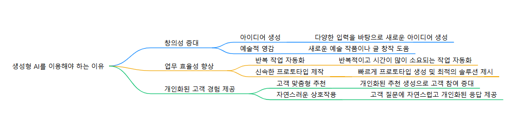

# 2025_PHwal
2025년 프로그래밍언어활용 1학기 
## 마크 다운 언어 사용 방법 
주요 마크다운 문법

# 제목1
## 제목2
### 제목3

### 강조
굵게: 텍스트를 ** 또는 __로 감쌉니다.
예시: **굵게** → 굵게
기울임: 텍스트를 * 또는 _로 감쌉니다.
예시: *기울임* → 기울임

### 목록
순서 없는 목록: -, +, * 기호로 항목을 나열합니다.
예시:
- 항목 1
- 항목 2

순서 있는 목록: 숫자와 점(.)을 사용하여 나열합니다.
예시:

복사
1. 첫 번째 항목
2. 두 번째 항목

### 링크
[텍스트](URL) 형식으로 링크를 추가할 수 있습니다.
```
[Google](https://www.google.com)
```

### 이미지
이미지 삽입은 링크와 유사하게  형식을 사용합니다.
```

```



### 코드 블록

인라인 코드: 백틱(`)으로 감쌉니다.
예시: `코드`
여러 줄 코드: 삼중 백틱(```)을 사용하여 코드 블록을 만듭니다.

## 맴버
1. LI JINGXIAN
2. LIU ZHENMING
3. 강승현
4. 금종혁
5. 김민호 https://github.com/kimminho-618/minho_03
6. 김수민 https://github.com/gaksultang


7. 김우진
8. 박소희 https://github.com/soheev030
9. 박준성 https://github.com/wnstjdqkr


10. 박지찬
11. 배진우 https://github.com/jinwoo6607


12. 우제준 https://github.com/dnwpwns

13. 윤덕규 https://duck718.github.io/duck718/


14. 이건우
15. 이동엽  https://github.com/dongyeopleehere  
16. 이성민
17. 이성윤 https://github.com/leolee-08
18. 이승학 https://github.com/beriussh  
19. 이창훈
20. 이채원 https://github.com/codnjs1129


21. 임도영
22. 장동현 https://github.com/donghyeon754


23. 장성훈 https://github.com/JangSeongHun99

24. 장승윤
25. 전준구
26. 전찬혁 https://github.com/ChanHyeok-Jeon


27. 정승빈 https://jung-sb.github.io/Jung-sb/
28. 정원영
29. 정일준 https://github.com/lljun27/lljun27
30. 최수호 https://github.com/choisuho12015
31. 최용제
